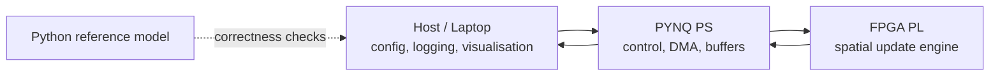

# FPGA-Accelerated Spatial Game Dynamics Simulator

A scoped FPGA/EEE group project for simulating simple local strategic interactions on a 2D grid. Many agents repeatedly play games such as Prisoner's Dilemma with nearby agents, update their strategies from local payoff, and produce visible spatial patterns of cooperation and competition.

## Start Here

New to the project? Read [docs/teammate_guide.md](docs/teammate_guide.md) first.

It explains the project from first principles: what the grid is, why simple rules create interesting patterns, why this fits FPGA hardware, what the MVP looks like, and how each teammate can contribute.

## What the Project Is

This project is a hardware-accelerated spatial evolutionary game simulator. It combines:

- A Python reference model for correctness and experimentation.
- An FPGA-friendly local update engine for repeated neighbourhood interactions.
- A PYNQ/host control layer for configuration, logging, and benchmarks.
- A visualisation layer for evolving grids, cooperation ratio, strategy counts, and payoff maps.

The intended result is a credible 35-day group project: simple local rules, clear FPGA acceleration, measurable speedup, and a visual demo that is easy to understand.

## What the Project Is Not

This is not a realistic social model, a market model, a human-intelligence project, or a simulation of people. Any broad "society" language should be treated only as a loose demo metaphor for spatial patterns, not the technical claim.

The technical focus is practical and narrow:

- Local interaction.
- Repeated games.
- Spatial dynamics.
- Parallel state updates.
- FPGA mapping and benchmarking.

## Why This Fits FPGA

The core update step is regular, local, and highly parallel. That is exactly the kind of repetitive work hardware can be good at:

- Each cell interacts only with nearby neighbours.
- Payoff lookup is small and deterministic.
- Strategy decision logic can be finite-state and compact.
- The grid can be double-buffered for synchronous updates.
- Update engines can be pipelined or replicated.
- Statistics such as strategy counts and payoff sums can be reduced in hardware.

The FPGA should accelerate computation, not just act as a communication bridge. The main comparison is CPU reference update speed versus FPGA update speed for the same rules.

## MVP: Keep It Small and Real

The minimum viable project is:

- 2D grid of agents.
- Each cell stores a strategy/state.
- Moore or Von Neumann neighbourhood.
- Repeated Prisoner's Dilemma as the first game.
- Strategies:
  - Always Cooperate.
  - Always Defect.
  - Tit-for-Tat.
  - Random(p).
  - Pavlov / Win-Stay-Lose-Shift.
- Update rule: accumulate payoff, then imitate the best-performing neighbour.
- Optional mutation/noise.
- Python reference model first.
- FPGA implements one spatial update engine or repeated-game match/update core.
- Host visualises cooperation ratio, strategy distribution, payoff heatmap, and evolving grid.

## System Architecture



Main modules:

- Python reference simulator.
- FPGA world update engine.
- Strategy decision unit.
- Payoff lookup unit.
- Neighbourhood fetch unit.
- Double-buffered world memory.
- RNG/LFSR mutation unit.
- Statistics reducer.
- Host/PYNQ control layer.
- Visualisation frontend.

## Mathematical Model, in Plain Terms

Agents occupy cells on a grid. At each generation:

1. Each agent plays a repeated game with local neighbours.
2. Payoffs are accumulated from neighbour interactions.
3. Each agent compares local payoff values.
4. Each agent copies the best-performing neighbour's strategy if it is better.
5. Optional mutation/noise perturbs strategy or action.
6. The next grid is committed synchronously using double buffering.

Default Prisoner's Dilemma payoff matrix:

| | Neighbour Cooperates | Neighbour Defects |
| --- | ---: | ---: |
| Agent Cooperates | R = 3 | S = 0 |
| Agent Defects | T = 5 | P = 1 |

## Hardware / Software Split

| Layer | Responsibility |
| --- | --- |
| Python model | Reference semantics, experiments, correctness tests |
| Host | Configuration, logging, benchmark scripts, visualisation |
| PYNQ PS | Overlay loading, DMA/control registers, frame transfer |
| FPGA PL | Local update pipeline, payoff computation, mutation RNG, statistics reduction |

## Visualisation Plan

Start with Python/matplotlib and move to a web dashboard only if time allows.

Minimum visual outputs:

- Evolving strategy grid.
- Cooperation ratio over time.
- Strategy population graph.
- Payoff heatmap.
- Final benchmark table.

Useful demo behaviours:

- Defectors spreading through cooperators.
- Cooperative clusters surviving by local reciprocity.
- Mutation/noise disrupting and reseeding patterns.
- Strategy distribution stabilising or oscillating.

## Benchmarks

Measure:

- Cells updated per second.
- Game rounds per second.
- Frames per second.
- CPU reference versus FPGA implementation.
- Correctness against Python on small grids.
- FPGA resource use: LUTs, FFs, BRAM, DSPs.
- Transfer overhead separately from kernel runtime.

Correctness comes before speed. Mutation/noise should be disabled for the first Python-versus-FPGA comparisons.

## Team Roles

| Role | Owner Focus |
| --- | --- |
| FPGA update engine | Payoff pipeline, strategy decision, mutation logic |
| Memory/interface/PYNQ | Buffers, DMA/control registers, packing format |
| Python model and theory | Reference simulator, game rules, experiment definitions |
| Visualisation/dashboard | Grid viewer, plots, demo interface |
| Testing/benchmarking | Unit tests, correctness checks, CPU/FPGA timing |
| Integration/report | Milestones, risk control, presentation and final report |

## Risk and Fallback Plan

| Tier | Deliverable |
| --- | --- |
| 0 | Python simulation and visualisation only |
| 1 | Single FPGA match/update core |
| 2 | Full grid update through FPGA |
| 3 | Multiple strategies and mutation |
| 4 | Advanced visualisation and experiments |
| 5 | Graph topologies or multi-board extension |

The project should freeze at the highest reliable tier rather than chase unstable stretch features.

## Extensions

Only after the MVP is working:

- Graph topologies instead of regular grids.
- Probabilistic transitions.
- Resource or energy fields.
- Reputation/trust values.
- Asynchronous updates.
- Multi-board distributed simulation.
- Expanded benchmark matrix.

## Repository Layout

```text
docs/                 Proposal, teammate guide, architecture, theory, and planning docs.
models/python/         Numpy reference simulator, examples, and tests.
rtl/                   SystemVerilog scaffold for FPGA update components.
pynq/                  PYNQ overlay/control placeholders.
frontend/              Python and web visualisation scaffolds.
benchmarks/            CPU baseline and benchmark schema/plans.
scripts/               Setup, tests, and formatting helpers.
reports/               Proposal/interim/final report outlines.
project_management/    Sprint plan, issue backlog, integration checklists.
```

## Current Status

The repository currently contains a runnable Python grid simulator, unit tests, visualisation helpers, RTL skeleton modules, PYNQ placeholders, benchmark scripts, and project documentation.

The current code supports the core grid/payoff/update path and a starter strategy set. The next implementation priorities are:

- add the remaining MVP strategy semantics,
- align packed state with RTL,
- validate a small deterministic grid against the Python reference model,
- keep the demo path simple and reliable.
