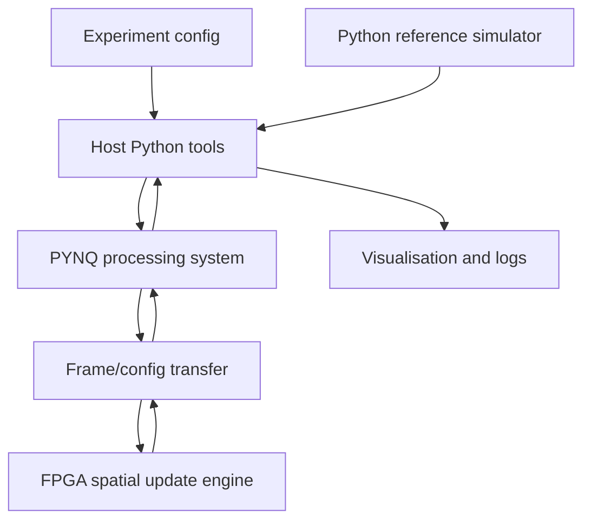
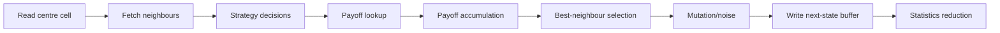

# Architecture

The architecture is built around a simple rule: each agent reads local state, plays a repeated game with neighbours, accumulates payoff, and writes a next state. The FPGA accelerates this regular state-transition loop.

## System View



## Main Modules

| Module | Role |
| --- | --- |
| Python reference simulator | Defines correct model semantics and generates test cases |
| FPGA world update engine | Runs one generation or tile update using hardware datapath |
| Strategy decision unit | Converts strategy state/history into cooperate/defect action |
| Payoff lookup unit | Applies the selected game payoff matrix |
| Neighbourhood fetch unit | Supplies Moore/Von Neumann neighbour state for a cell |
| Double-buffered world memory | Separates current and next generation state |
| RNG/LFSR mutation unit | Provides deterministic hardware randomness for mutation/noise |
| Statistics reducer | Counts strategies, cooperation events, and payoff totals |
| Host/PYNQ control layer | Loads overlay, configures registers, manages buffers |
| Visualisation frontend | Displays grid, heatmaps, plots, and benchmark summaries |

## Data Model

Agent state fields:

| Field | Purpose | MVP Representation |
| --- | --- | --- |
| `strategy_id` | Which strategy rule the agent follows | 3 bits target; 2 bits for first bring-up |
| `last_action` | Previous cooperate/defect action | 1 bit |
| `payoff` | Accumulated local payoff for current generation | signed fixed-width integer |
| `age` or generation counter | Optional debugging/extension field | optional small integer |
| random seed/state | Optional per-agent randomness | optional, can be global LFSR first |

Game parameters:

| Parameter | Example |
| --- | --- |
| payoff matrix | `R=3, S=0, T=5, P=1` |
| mutation probability | `0`, `0.001`, `0.01` |
| neighbourhood type | Moore or Von Neumann |
| grid size | `64x64`, `128x128`, `256x256` |
| number of steps | `100`, `1000`, `10000` |
| initial strategy distribution | 50/50 cooperate/defect or fixed seed mix |

## Spatial Update Pipeline



The first implementation can process one cell over several cycles. A later version can pipeline the stages or replicate update engines.

## Double Buffering

The simulator must avoid in-place updates:

- `world_current` is read for all cells in generation `t`.
- `world_next` receives all cells for generation `t + 1`.
- Buffers swap only after the full generation completes.

This prevents scan-order artefacts and makes Python/FPGA comparison easier.

## Host / PS / PL Split

| Layer | Responsibilities |
| --- | --- |
| Host laptop | Experiment config, Python reference runs, logging, plots, dashboard |
| PYNQ PS | Overlay loading, DMA/control setup, frame packing, board communication |
| FPGA PL | Neighbour fetch, payoff/update pipeline, mutation RNG, statistics |

## Interface Sketch

Minimal transfer payloads:

```text
config:
  width, height
  neighbourhood_type
  payoff_R, payoff_S, payoff_T, payoff_P
  mutation_threshold
  step_count

input frame:
  packed_agent_words[height * width]

output frame:
  packed_agent_words[height * width]

metrics:
  strategy_counts[]
  cooperation_count
  payoff_sum
  generation
```

## Correctness Strategy

1. Disable mutation/noise.
2. Use fixed tiny grids such as `4x4` and `8x8`.
3. Run one generation in Python.
4. Run the same generation through the FPGA path.
5. Compare exact next-state frames and statistics.
6. Only then add mutation/noise and larger benchmark grids.

## Extension Architecture

Extensions should not disturb the MVP datapath unless the base system is stable:

- More strategy IDs.
- Graph topologies with adjacency lists.
- Resource/energy field as a second grid.
- Asynchronous updates in software first.
- Multi-board partitioning with border exchange.
