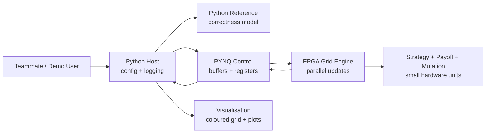

# Teammate Guide

Everything you need to quickly understand why this project is cool, practical, and technically grounded.

## 1. Opening Hook

Imagine thousands of tiny hardware agents living on a grid.

Each one only knows a few things:

- What strategy am I using?
- What did my neighbours do recently?
- Did I score well or badly?
- Should I keep my strategy or copy a better neighbour?

Individually, the rules are tiny. Together, the grid can produce large-scale patterns that you can watch: cooperation clusters, waves of defectors, collapse, recovery, and regions that keep changing over time.

That is the heart of this project:

> Simple local rules can create interesting global behaviour.

We are not trying to simulate real society. We are building a visual, FPGA-friendly system for exploring how lots of small local updates interact.

## 2. So... What Are We Actually Building?

We are building a simulator with three main parts:

| Part | Plain-English Meaning |
| --- | --- |
| 2D grid | A board of cells, like pixels or tiles |
| Agent | One cell on the grid |
| Strategy | The simple rule that tells an agent how to act |
| Score/payoff | How well an agent did after interacting |
| Update rule | How the next grid is produced |
| Visualisation | A live picture of the grid changing |

Each step looks like this:

1. Every cell looks at nearby neighbours.
2. Each cell plays a very simple game with them.
3. Cells gain or lose score.
4. Successful strategies spread locally.
5. The next grid appears.
6. We draw the result as colours and plots.

The FPGA's job is to perform many of these local updates quickly and regularly. The host computer handles setup, logging, benchmarks, and visualisation.

## 3. Why This Is Interesting

Some systems become interesting not because each part is clever, but because many simple parts interact.

Good examples:

- Conway's Game of Life: simple grid rules create gliders, oscillators, and patterns.
- Ant colonies: each ant follows simple local cues, but the colony looks organised.
- Flocking birds: each bird follows nearby birds, yet the whole flock moves smoothly.
- Crowds: people make local movements, but large-scale flows appear.
- Swarm systems: many small units create behaviour no single unit planned.

Our project is in this family.

We give each cell a small rule. Then we let thousands of cells update together. The interesting part is watching the global pattern emerge from local decisions.

## 4. The Prisoner's Dilemma: Simple Story Version

Game theory is not the main focus of the project. It is just the rule system that drives interactions.

The first rule system we use is Prisoner's Dilemma.

Imagine two neighbouring agents meet. Each chooses one action:

- cooperate
- defect

The outcome is:

| Agent A | Agent B | What Happens |
| --- | --- | --- |
| Cooperate | Cooperate | Both do well |
| Cooperate | Defect | A gets exploited, B gains more |
| Defect | Cooperate | A gains more, B gets exploited |
| Defect | Defect | Both do badly |

A common payoff table is:

| | Neighbour Cooperates | Neighbour Defects |
| --- | ---: | ---: |
| Agent Cooperates | 3 | 0 |
| Agent Defects | 5 | 1 |

So defecting can be tempting in one interaction. But now imagine the same idea repeated across thousands of agents on a grid.

If cooperators form a cluster, they can reward each other. If defectors spread too much, they may end up surrounded by other defectors and score poorly. This is where the patterns start.

Agents do not need to be intelligent. They just follow simple strategies:

- Always Cooperate.
- Always Defect.
- Tit-for-Tat.
- Random(p).
- Pavlov / Win-Stay-Lose-Shift.

Then, after scoring, agents can copy successful neighbours.

## 5. What Makes This an FPGA Project?

The FPGA fit is very natural.

Every cell is doing almost the same kind of work:

- read nearby cells,
- decide actions,
- look up payoff,
- accumulate score,
- choose a next state,
- write the result.

Also, each cell only needs local information. It does not need to scan the whole grid.

That makes the project feel like a giant hardware cellular automaton:

```text
many simple cells
same update rule
local neighbours only
synchronous next-state update
```

This maps well to FPGA ideas:

| FPGA Idea | Project Meaning |
| --- | --- |
| Parallelism | Many cells or interactions can be processed at once |
| Pipeline | Different update stages can run in sequence every clock |
| Local state | Each cell has compact state bits |
| Deterministic timing | Updates happen in predictable cycles |
| Replication | Add more update engines for more throughput |
| Double buffering | Read old grid, write new grid, then swap |

The FPGA is not just moving data around. It is doing the repeated local computation.

## 6. High-Level System Overview



The important split:

- Python helps us understand and verify the model.
- FPGA accelerates the repeated local update.
- Visualisation makes the result easy to see and demo.

## 7. From Idea to Hardware

Here is how the friendly idea turns into hardware:

| Concept | Hardware View |
| --- | --- |
| Agent | Small state word in memory |
| Strategy | Encoded integer, such as `0`, `1`, `2` |
| Cooperate/defect | One action bit |
| Score | Small register or fixed-width integer |
| Neighbour interaction | Read nearby state words |
| Payoff table | Tiny lookup table |
| Mutation/noise | LFSR random bit and threshold |
| Update | Clocked state transition |

So an "agent" is not a complicated software object in hardware. It is closer to:

```text
strategy bits + last action bit + optional flags
```

That is why the project is manageable.

## 8. Tiny Hardware Examples

These snippets are intentionally small. They are here to make the hardware idea less mysterious.

### Action Encoding

```systemverilog
// One bit is enough for the first game.
localparam logic ACTION_COOPERATE = 1'b0;
localparam logic ACTION_DEFECT    = 1'b1;
```

### Strategy Encoding

```systemverilog
// A few bits can represent the strategy used by each cell.
localparam logic [2:0] STRAT_COOPERATE = 3'd0;
localparam logic [2:0] STRAT_DEFECT    = 3'd1;
localparam logic [2:0] STRAT_TFT       = 3'd2;
localparam logic [2:0] STRAT_RANDOM    = 3'd3;
localparam logic [2:0] STRAT_PAVLOV    = 3'd4;
```

### Simple Decision Rule

```systemverilog
always_comb begin
    unique case (strategy_i)
        STRAT_COOPERATE: action_o = ACTION_COOPERATE;
        STRAT_DEFECT:    action_o = ACTION_DEFECT;
        STRAT_RANDOM:    action_o = random_bit_i;
        default:         action_o = ACTION_COOPERATE;
    endcase
end
```

### Tiny Payoff Lookup

```systemverilog
always_comb begin
    if (!my_action_i && !neighbour_action_i) begin
        payoff_o = 4'd3; // both cooperate
    end else if (!my_action_i && neighbour_action_i) begin
        payoff_o = 4'd0; // I cooperate, neighbour defects
    end else if (my_action_i && !neighbour_action_i) begin
        payoff_o = 4'd5; // I defect, neighbour cooperates
    end else begin
        payoff_o = 4'd1; // both defect
    end
end
```

This is the kind of small, regular logic FPGA hardware is good at repeating many times.

## 9. What the Visualisation Could Look Like

The visual side is one of the best parts of the project.

We can show:

- a coloured grid where each colour is a strategy,
- cooperation heatmaps,
- payoff heatmaps,
- clusters spreading or shrinking,
- waves moving across the grid,
- strategy population graphs over time,
- CPU versus FPGA speed comparisons.

This makes the project easy to explain in a demo. People do not need to understand every detail of the payoff table to see that the system is changing and producing patterns.

## 10. Simple MVP Plan

### Stage 1: Python Simulation

- Build the rules in Python.
- Run small grids.
- Draw the grid.
- Save metrics.

### Stage 2: Simple FPGA Interaction Logic

- Implement payoff lookup.
- Implement basic strategy decision.
- Test small modules.

### Stage 3: Grid Updates on FPGA

- Pack grid state into bytes.
- Send frame to FPGA.
- Compute next frame.
- Compare against Python.

### Stage 4: Live Visualisation

- Show the grid updating.
- Plot cooperation ratio and strategy counts.
- Display benchmark numbers.

### Stage 5: Extensions

- Add mutation/noise.
- Add more strategies.
- Try graph layouts.
- Try multi-board experiments only if everything else works.

## 11. Why This Is Manageable

This is not an impossible "simulate the world" project.

It is manageable because:

- agents are intentionally simple,
- the grid structure is regular,
- each update only needs neighbours,
- the first game has a tiny payoff table,
- Python can act as the reference answer,
- the FPGA can start with one small update core,
- every extension is optional.

The MVP is small:

```text
grid + local payoff + imitate best neighbour + visualise
```

That is enough for a strong project.

## 12. Possible Extensions

Only after the MVP works:

- mutation or action noise,
- safe user-defined strategies through a small rule format,
- graph topologies instead of grids,
- different games,
- reputation values,
- resource fields,
- asynchronous updates,
- wireless or Ethernet multi-board agents,
- strategy evolution experiments.

These are exciting, but they are not required for success.

## 13. Why This Project Stands Out

This project has a nice balance:

| Strength | Why It Helps |
| --- | --- |
| Visual | The grid changes on screen, so the demo is easy to follow |
| FPGA-friendly | Local parallel updates are a natural hardware workload |
| Modular | Python, RTL, PYNQ, visualisation, and benchmarking can be split |
| Mathematical but approachable | The rules are simple enough to explain quickly |
| Different | It is not just another sensor dashboard or static visualiser |
| Scalable | The same idea can grow from one update core to many |

It also gives different teammates different ways to contribute.

## 14. Team Roles

| Role | What You Work On |
| --- | --- |
| FPGA logic | Payoff unit, update engine, strategy decision, LFSR |
| Python simulation | Reference model, rule experiments, correctness cases |
| Visualisation | Coloured grid, charts, demo interface |
| PYNQ/integration | Buffers, control path, moving frames in and out |
| Experiments/benchmarking | CPU vs FPGA timing, plots, reproducible runs |
| Documentation/project management | Proposal, report, slides, integration checklist |

Nobody needs to understand everything on day one. The project is designed so each subsystem has a clear job.

## 15. Final Thought

This project is really about one beautiful engineering idea:

> Put simple local rules on parallel hardware, run them many times, and watch rich global behaviour emerge.

That is interesting, doable, and very demo-friendly. The ambition is not to build artificial people or model the real world. The ambition is to build a clean FPGA system where simple state machines interact, update, and create patterns we can see, measure, and explain.
