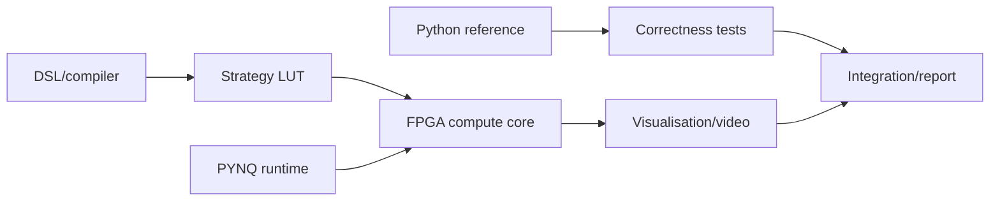

# Work Split

This split is designed for six people and matches the Exploratory Game Theory Platform extension direction.

| Role | Focus | Example Deliverables |
| --- | --- | --- |
| 1. FPGA compute core | Hardware update and match logic | Payoff unit, strategy LUT execution, update engine, mutation LFSR |
| 2. Memory / DMA / PYNQ runtime | Getting data in and out | Packed frames, BRAM/register maps, DMA tests, runtime controls |
| 3. Strategy DSL / compiler | Safe user strategy definitions | Parser, validator, FSM representation, LUT generator |
| 4. Mathematical modelling / reference simulator | Correctness and experiments | Python reference model, arena metrics, invasion rules, benchmark strategies |
| 5. Visualisation / video / UI | Making dynamics visible | Grid viewer, frame export, `ffmpeg` workflow, charts/dashboard |
| 6. Integration / project management / report / testing | Keeping it coherent | Milestones, test plan, report, demo script, risk/fallback tracking |

## How the Work Connects

## Suggested Ownership Boundaries

### 1. FPGA Compute Core

- Implement payoff lookup.
- Execute strategy LUT transitions.
- Implement local update / match core.
- Add mutation/noise hooks.
- Provide RTL testbenches.

### 2. Memory / DMA / PYNQ Runtime

- Define packed frame format.
- Load strategy LUTs into hardware memory/registers.
- Move frames and metrics between CPU and FPGA.
- Measure transfer overhead.

### 3. Strategy DSL / Compiler

- Define a tiny safe strategy format.
- Validate user strategies.
- Compile FSMs into lookup tables.
- Provide clear error messages for invalid strategies.

### 4. Mathematical Modelling / Reference Simulator

- Keep Python semantics authoritative.
- Implement arena and spatial rules.
- Define metrics such as cooperation rate and robustness under noise.
- Produce deterministic test cases for hardware comparison.

### 5. Visualisation / Video / UI

- Render strategy grids.
- Plot metrics over time.
- Save frames and generate video exports.
- Make demos understandable to non-specialists.

### 6. Integration / Project Management / Report / Testing

- Maintain the build/run instructions.
- Keep fallback tiers honest.
- Coordinate weekly integration.
- Write the report narrative around what was actually achieved.

## Practical Rule

Each subsystem should have a small standalone demo before full integration. That keeps the project from becoming six unfinished parts waiting for one big final merge.
